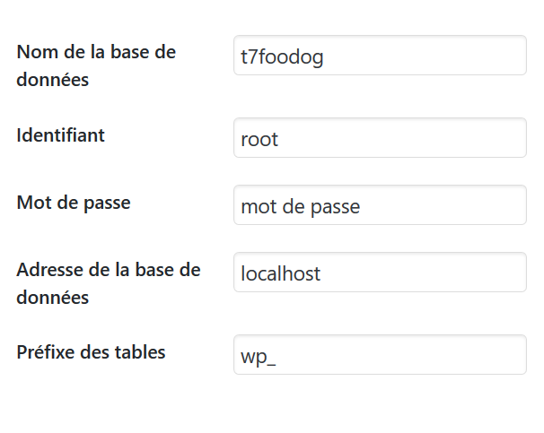
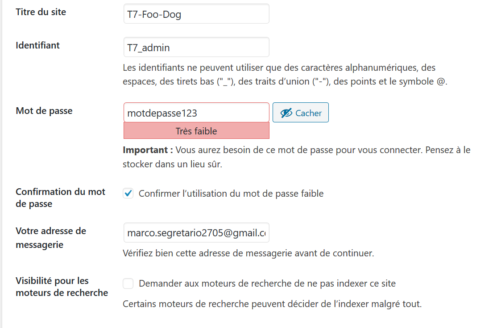
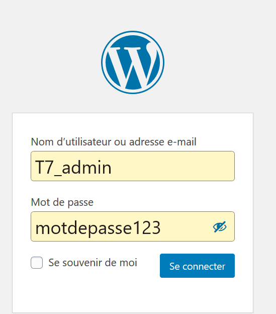

# T7-FooDog-WP

## par la team 7

* Stéphane Léonard
* Jean Mourmeaux
* Luciano Caturano
* Marco Segretario

## Déroulement du projet

Pour commencer nous avons créer un serveur discord entièrement dédié à notre équipe avec pas moins de 1000 messages, 7 debrief de team en fin de journée + des appels entre nous pour s'aider + les appels du matin pour la répartitions des tâches.

Lors de l'annoncement du projet le jeudi 14, nous avons directement réalisé un kanban et un vocal pour se partager les informations, suite à quoi nous nous sommes donné 2 jours pour apprendre les particularités de WordPress grâce à Grafikart.

Lors de la première semaine, nous avons départager le travail entre nous, sans aucun problème jusque là.
Le premier jour arrive l'installation de la DB + PHP, Marco et Stephane n'ont aucun problème mais Jean et Luciano ont eu BEAUCOUP de mal, ce qui nous a ammené à la solution Docker qui a absolument réglé tout nos problèmes en 1200 secondes.

le groupe s'entraide bien durant tout le projet, peut importe si certains ont manqué d'internet (merci VOO), eu des priorités personnels, les membres répondait toujours présent. 

Ensuite le groupe continua sur une bonne lancée jusqu'au dernier jour.

## Difficultés rencontrées 

Beaucoup de difficulté pour ce projet :

* WordPress n'est pas simple à prendre en main.

* Le from scratch est vraiment hard mais il existe un bon nombre de tuto sur internet et la documentation est plutôt bien fournie.

* L'imcompatibilité avant l'utilisation de Docker.

* Le télé-travail, vraiment compliqué pour certains au niveau concentration avec tout les aléas que nous offre notre vie quotidienne.

* Bug survenu à la finalisation du travail malgrés 6 branches crées pour bien travaillé séparemment et ne pas marcher sur le travail d'un autre.

* Le transfer de la base de donnée entre nous lors de la finalisation

## Technos utilisées

- Docker
- Github Kanban
- Php-storm
- Visual studio Code
- Word press

